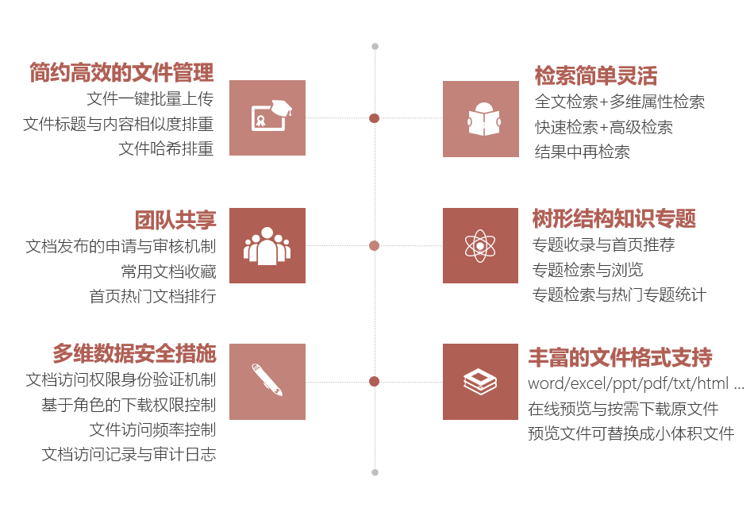
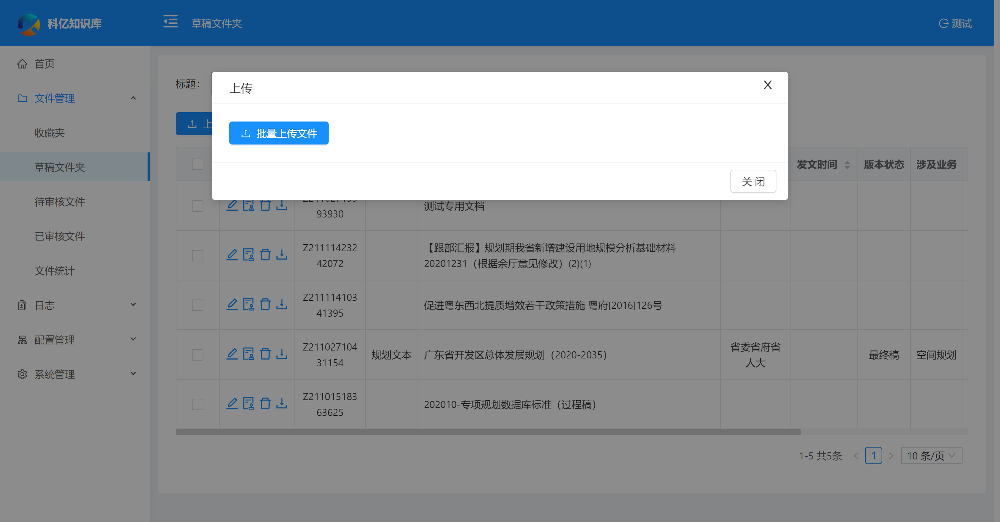

科亿知识库 KY KMS
===============
当前最新版本： V0.0.1（发布日期：20220322）

项目介绍：
-----------------------------------

<h3 align="center">基于常用文档的知识库管理系统</h3>

科亿知识库 KY KMS 是一款面向常用文档的`文档型知识库管理系统`！

我们日常工作中产生大量的文档，随着存储技术的进步，使得存储文件的成本越来越低。最终，几乎所有的文档，都被积累下来。

我们积累下来的文档，是一笔巨大的财富，但文档越多，我们在其中找到所需要文档越费劲，于是，搭建一套便捷、实用的文档知识库管理系统变得非常有价值。

`科亿知识库宗旨是:` 文档简单整理，知识创造价值


适用项目
-----------------------------------
科亿知识库，可以应用在任何需要进行常用文档整理、分类、归集、检索的地方，尤其适合知识密集型单位/历史文档丰富的单位。


交流互动
-----------------------------------

- 在线演示 ：  [http://www.kykms.cn:90](http://www.kykms.cn:90) 账号：admin/123456
- QQ ： 22247537
- Mail : hnliuwx#tom.com
- github: [https://github.com/mahonelau/kykms](https://github.com/mahonelau/kykms)
- gitee: [https://gitee.com/kyxxjs/km_community](https://gitee.com/kyxxjs/km_community)
- 微信 ： 如果你有任何产品上的想法、意见或建议，或商务上的合作需求，请扫码添加我们微信进一步沟通：


为什么选择KY KMS?
-----------------------------------
科亿知识库基于强大的Elasticsearch检索引擎技术构建，检索能力强大，支持最全面的检索特性，同时检索性能卓越，可以无限可能的集群扩展，支持高达百亿级别的记录数量。
在关系数据库方面支持mysql与oracle，更多的数据库支持在陆续准备中。

 
 - 更多 ：  [http://www.kykms.cn](http://www.kykms.cn)


技术架构：
-----------------------------------
#### 开发环境
- 语言：Java 8
- IDE(JAVA)： IDEA / Eclipse安装lombok插件 
- IDE(前端)： WebStorm 或者 IDEA
- 依赖管理：Maven
- 数据库：MySQL5.7+  &  Oracle 11g & Sqlserver2017
- 缓存：Redis
- Node Js: 10.0 +
- Npm: 5.6.0+
- Yarn: 1.21.1+ 

#### 后端
- 基础框架：Spring Boot 2.3.5.RELEASE
- 持久层框架：Mybatis-plus 3.4.1
- 检索引擎：ElasticSearch 7.6.1
- 文档处理与转换： Libre Office 7.1.4
- 文本提取：Tika 1.17
- 安全框架：Apache Shiro 1.7.0，Jwt 3.11.0  
- 数据库连接池：阿里巴巴Druid 1.1.22 
- 缓存框架：redis 
- 日志打印：logback 
- 其他：fastjson，poi，Swagger-ui，quartz, lombok（简化代码）等。


#### 前端
 
- [Vue 2.6.10](https://cn.vuejs.org/),[Vuex](https://vuex.vuejs.org/zh/),[Vue Router](https://router.vuejs.org/zh/)
- [Axios](https://github.com/axios/axios)
- [ant-design-vue](https://vuecomponent.github.io/ant-design-vue/docs/vue/introduce-cn/)
- [webpack](https://www.webpackjs.com/),[yarn](https://yarnpkg.com/zh-Hans/)
- [vue-cropper](https://github.com/xyxiao001/vue-cropper) - 头像裁剪组件
- [@antv/g2](https://antv.alipay.com/zh-cn/index.html) - Alipay AntV 数据可视化图表
- [Viser-vue](https://viserjs.github.io/docs.html#/viser/guide/installation)  - antv/g2 封装实现
- eslint，[@vue/cli 3.2.1](https://cli.vuejs.org/zh/guide)

### 功能模块
```
├─检索首页
│  ├─普通检索
│  ├─高级检索
│  ├─文档预览
│  ├─文档分类
│  ├─知识专题
│  ├─高频访问文档
│  ├─热词统计
│  ├─热门专题统计
├─系统管理
│  ├─用户管理
│  ├─角色管理
│  ├─菜单管理
│  ├─权限设置（支持按钮权限、数据权限）
│  ├─表单权限（控制字段禁用、隐藏）
│  ├─部门管理 
├─文件管理
│  ├─草稿文件上传
│  ├─文档编辑
│  ├─收藏夹
│  ├─待审核文件
│  ├─已审核文件 
│  ├─文件统计 
├─配置管理
│  ├─知识专题定义
│  ├─文档属性定义
├─日志
│  ├─文档操作记录
│  ├─系统日志 
└─其他模块
   └─更多功能开发中。。
   
```
 
项目下载和运行
----
开发环境准备与运行，请参考：开发环境准备与运行.md
- 默认登录账号： admin/123456


系统效果
----

##### 公共检索
检索首页

检索结果

高级检索

知识专题


##### 管理后台
热词统计

批量上传

编辑


附属文档
----
- [Ant Design Vue](https://www.antdv.com/docs/vue/introduce-cn)


特别鸣谢
-----------------------------------
本项目采用Jeecg-boot开发框架，Jeecg-boot，一款优秀的后台管理快速开发框架，让你更专注于业务开发的实现。
- JeecgBoot： [http://doc.jeecg.com](http://doc.jeecg.com)


## 捐赠 

如果觉得还不错，请作者喝杯咖啡鼓励一下吧，敲代码不容易 ☺


