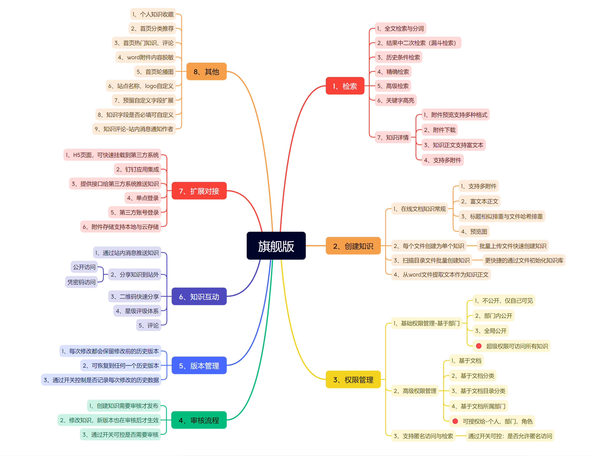
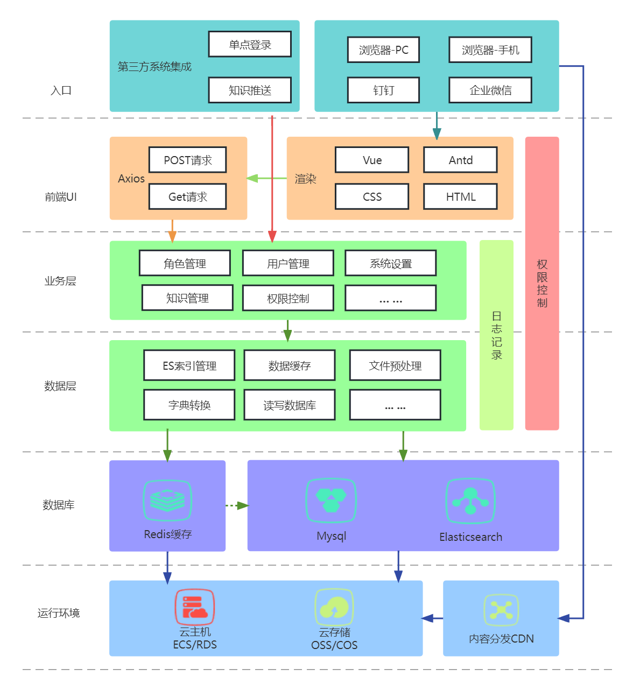
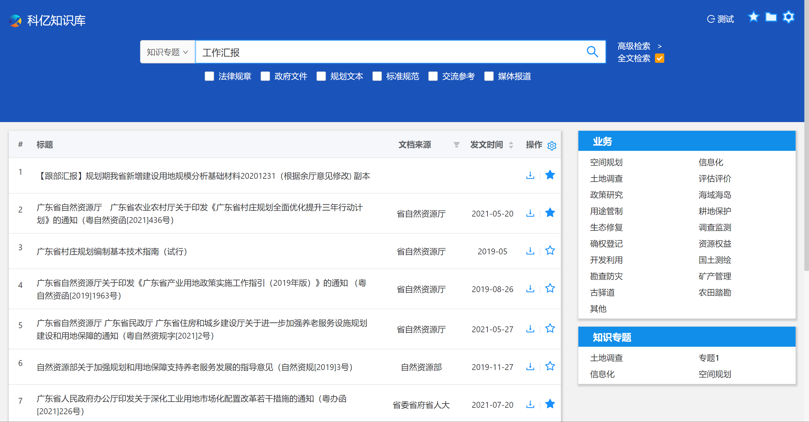
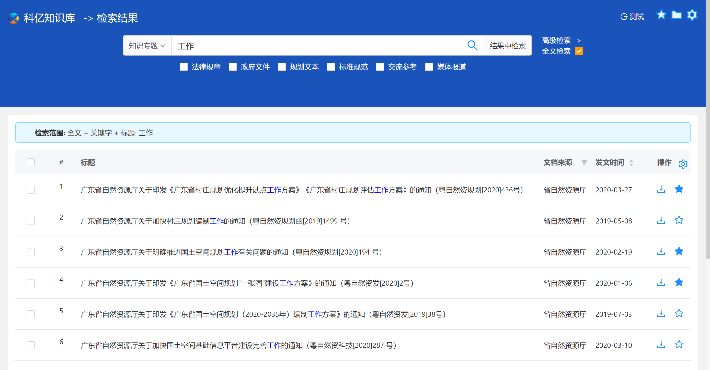
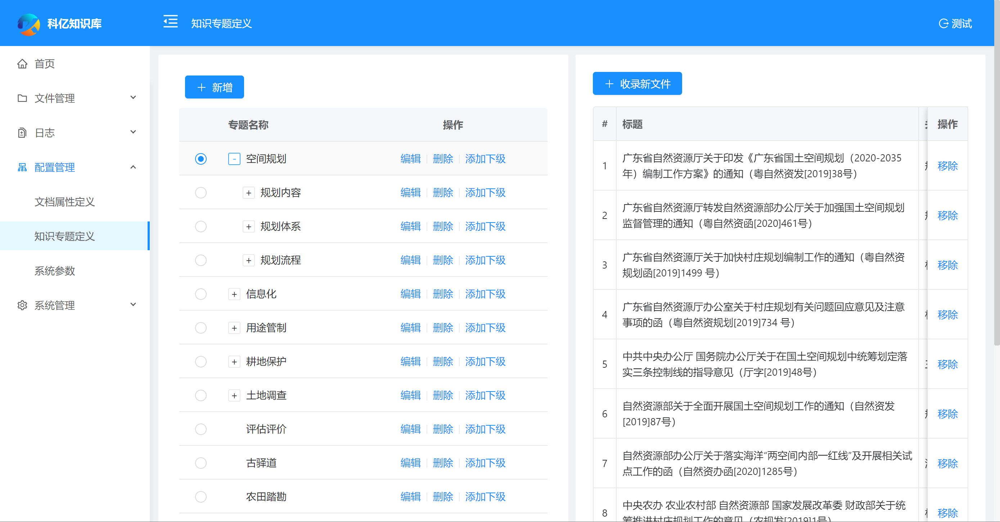
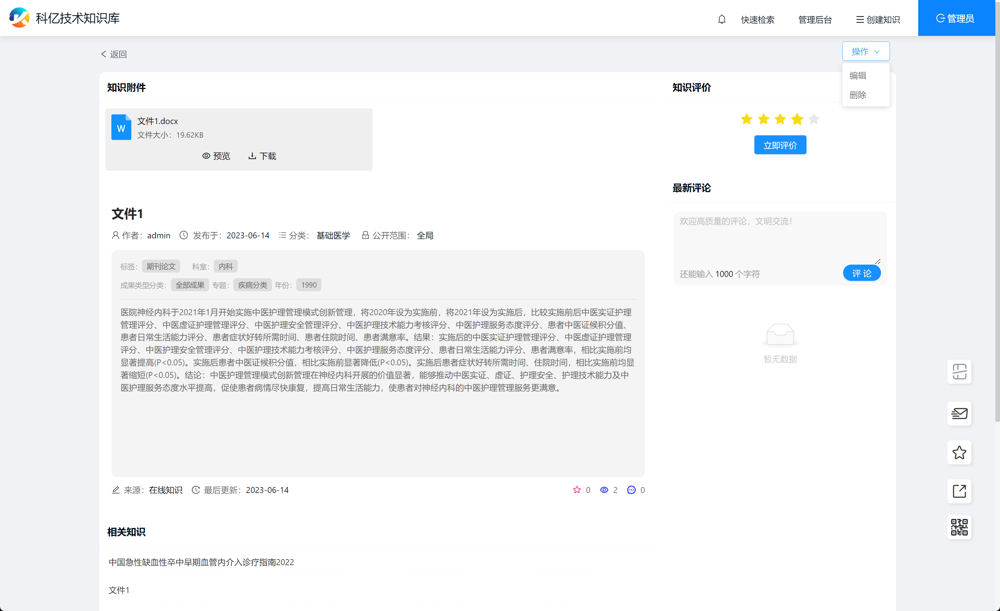
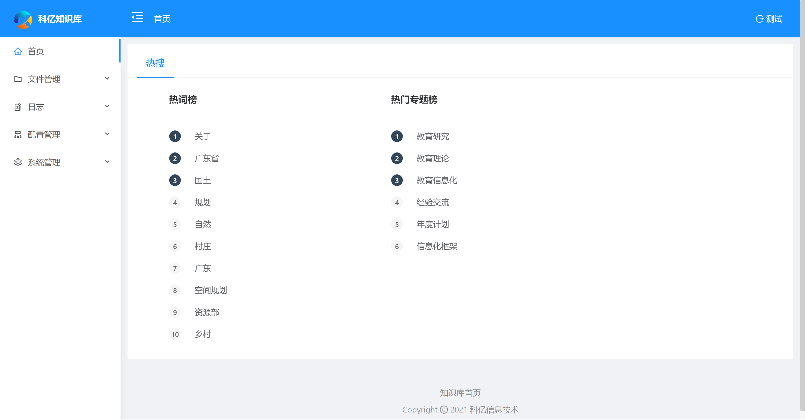
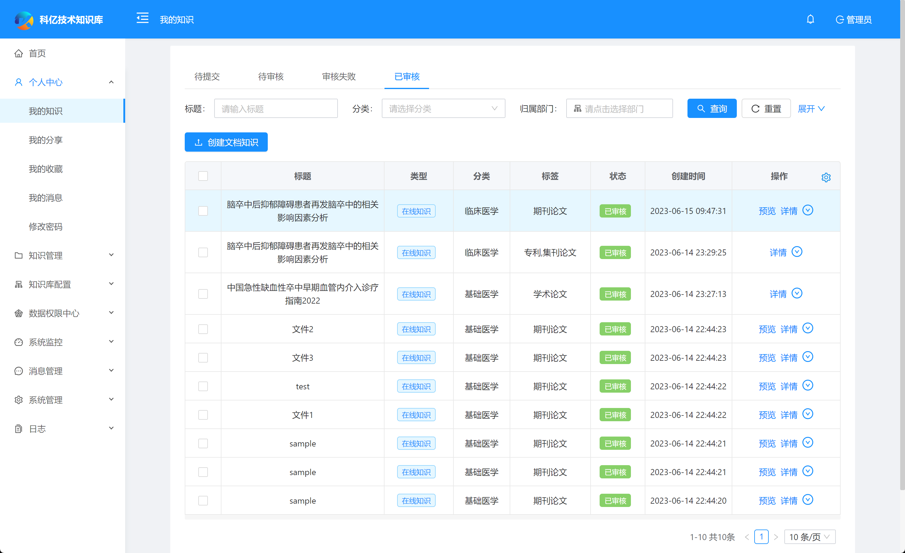
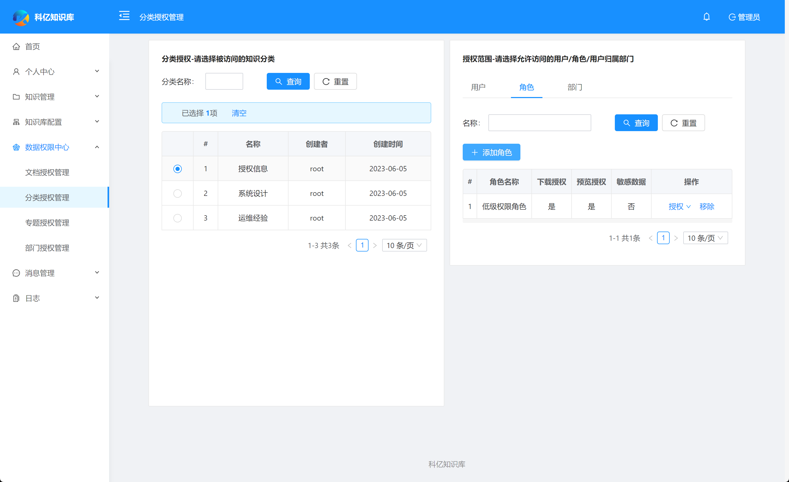
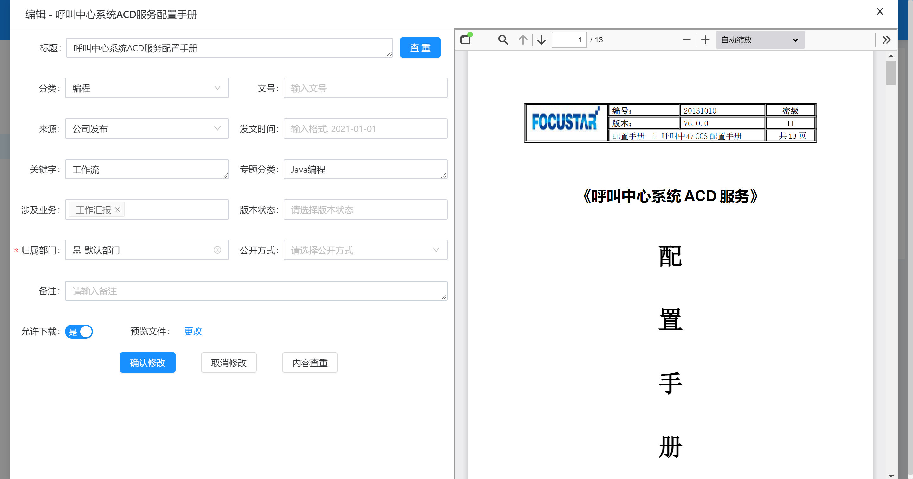

科亿知识库 KY KMS
===============
当前最新版本： V1.0.1（发布日期：20230615）

项目介绍：
-----------------------------------
- 科亿知识库 KY KMS 既是一款知识库，同时也是一款易于上手的文档管理工具！
- 强大灵活的知识访问权限管理组合，精准快速的多维检索功能，全文检索与在线预览有着齐全的文件格式支持，版本管理控制与回滚，丰富的扩展接口支持与第三方集成，多种知识分享沟通方式。
科亿知识库开发缘起，是一事业单位需要整理并利用大量的历史文档，这些文档以office文件与pdf文件为主。
- 科亿知识库宗旨是: `文件简单整理，知识创造价值`

适用场景
-----------------------------------
科亿知识库，可以应用在任何需要进行常用文件管理、分类、归集、检索的地方，以及需要对大数据进行管理和检索的场景，尤其适合知识密集型单位/历史文档丰富的单位。
开源版适合个人学习和自用，提供基础功能，可以完整运行；专业版与旗舰版则提供更强大的功能，并附带技术服务，如需要请联系商务。

交流互动
-----------------------------------
- 官方站点 ：  [http://www.kykms.cn](http://www.kykms.cn)
- 技术文档 ：  [进入](http://docs.kykms.cn/docs/mindoc/mindoc-1ephusv88b42s)
- 本产品有三个版本：开源版、专业为版、旗舰版 - [版本功能比较](http://www.kykms.cn/edition)
- 旗舰版在线演示 ：  [http://kg.kykms.cn](http://kg.kykms.cn) 账号：admin/123456
- 专业在线演示 ：  [http://test.kykms.cn](http://test.kykms.cn) 账号：admin/123456
- QQ技术交流群 ： 782686853
- Mail : hnliuwx#tom.com
- github: [https://github.com/mahonelau/kykms](https://github.com/mahonelau/kykms)
- gitee: [https://gitee.com/kyxxjs/km_community](https://gitee.com/kyxxjs/km_community)
- 微信 ： 如果你有任何产品上的想法、意见或建议，或商务上的合作需求，请扫码添加我们微信进一步沟通：


系统部署和开发环境搭建
----

- ### 本地部署安装
手册(推荐)： [在线文档](http://docs.kykms.cn/docs/mindoc/mindoc-1eqploikpjlkc)


- ### 开发环境准备与运行
请参考：[开发环境准备与运行](./开发环境准备与运行.MD)
- 默认登录账号： admin/123456

版权声明
-----------------------------------
本着开源精神，科亿遵循 GPL-3.0 开源协议发布，提供源码用于学习、自用与技术交流，但不允许修改后和衍生的代码做为闭源的商业软件发布和销售 ！ 如果需要将本产品在本地进行任何附带商业化性质行为使用， 请联系项目负责人进行商业授权 ，以遵守 GPL 协议保证您的正常使用。 
科亿开源团队拥有对本开源协议的最终解释权。


为什么选择KY KMS?
-----------------------------------
- 基于强大的 Elasticsearch 检索引擎技术构建，检索能力强大，支持最全面的检索特性，可以无限可能的集群扩展，支持高达百亿级别的数量。
- 附件内容全文检索、结果中二次检索、高级组合检索，支持精准匹配，关键词高亮显示。
- 灵活强大的知识访问权限管理模型，在不同层次和实体进行数据权限管控。
- 适配手机端 H5，支持集成到钉钉、企业微信，支持单点登录与对接第三方系统推送知识。
- 站内、站外分享，评价与评论体系，知识收藏，版本控制与回滚。 

KMS功能思维导图
-----------------------------------


KMS技术架构图
-----------------------------------



技术架构：
-----------------------------------
#### 技术亮点
- 主流技术，生态完善，易于维护
- 前后端分离，接口文档清晰，易于二次开发
- 后端采用ES搜索引擎，可以按需实行分部署部署
 
#### 开发环境
- 语言：Java 8
- IDE(JAVA)： IDEA / Eclipse安装lombok插件 
- IDE(前端)： WebStorm 或者 IDEA
- 依赖管理：Maven
- 数据库：MySQL5.7+  &  Oracle 11g & Sqlserver2017
- 缓存：Redis
- Node Js: 10.0 +
- Npm: 5.6.0+
- Yarn: 1.21.1+ 

#### 后端
- 基础框架：Spring Boot 2.3.5.RELEASE
- 持久层框架：Mybatis-plus 3.4.1
- 检索引擎：ElasticSearch 7.6.1
- 文档处理与转换： Libre Office 7.1.4
- 文本提取：Tika 1.17
- 安全框架：Apache Shiro 1.7.0，Jwt 3.11.0  
- 数据库连接池：阿里巴巴Druid 1.1.22 
- 缓存框架：redis 
- 日志打印：logback 
- 其他：fastjson，poi，Swagger-ui，quartz, lombok（简化代码）等。


#### 前端
 
- [Vue 2.6.10](https://cn.vuejs.org/),[Vuex](https://vuex.vuejs.org/zh/),[Vue Router](https://router.vuejs.org/zh/)
- [Axios](https://github.com/axios/axios)
- [ant-design-vue](https://vuecomponent.github.io/ant-design-vue/docs/vue/introduce-cn/)
- [webpack](https://www.webpackjs.com/),[yarn](https://yarnpkg.com/zh-Hans/)
- [vue-cropper](https://github.com/xyxiao001/vue-cropper) - 头像裁剪组件
- [@antv/g2](https://antv.alipay.com/zh-cn/index.html) - Alipay AntV 数据可视化图表
- [Viser-vue](https://viserjs.github.io/docs.html#/viser/guide/installation)  - antv/g2 封装实现
- eslint，[@vue/cli 3.2.1](https://cli.vuejs.org/zh/guide)

### 功能模块
```
├─检索首页
│  ├─普通检索
│  ├─高级检索
│  ├─文档预览
│  ├─文档分类
│  ├─知识专题
│  ├─高频访问文档
│  ├─热词统计
│  ├─热门专题统计
├─系统管理
│  ├─用户管理
│  ├─角色管理
│  ├─菜单管理
│  ├─权限设置（支持按钮权限、数据权限）
│  ├─表单权限（控制字段禁用、隐藏）
│  ├─部门管理 
├─文件管理
│  ├─草稿文件上传
│  ├─文档编辑
│  ├─收藏夹
│  ├─待审核文件
│  ├─已审核文件 
│  ├─文件统计 
├─配置管理
│  ├─知识专题定义
│  ├─文档属性定义
├─日志
│  ├─文档操作记录
│  ├─系统日志 
└─其他模块
   └─更多功能开发中。。
   
```

系统效果(旗舰版)
----

##### 公共检索
检索首页

检索结果

高级检索

知识专题

知识详情

知识分享


##### 管理后台
数据统计

知识管理

授权管理

编辑与创建



附属文档
----
- [Ant Design Vue](https://www.antdv.com/docs/vue/introduce-cn)


特别鸣谢
-----------------------------------
本项目采用Jeecg-boot开发框架，Jeecg-boot，一款优秀的后台管理快速开发框架，让你更专注于业务开发的实现。
- JeecgBoot： [http://doc.jeecg.com](http://doc.jeecg.com)


## 捐赠 

如果觉得还不错，请作者喝杯咖啡鼓励一下吧，敲代码不容易 ☺


