<p align="center"></p>
<h1 align="center">科亿知识库  KYKMS</h1>

# 🚀全新设计 - KMatrix

**`KMatrix`**： 基于 RuoYi-Vue-Plus 与 LangChain4j 构建的，源于KYKMS，超越KYKMS，全新设计理念，全面拥抱AI与大模型的新一代 AI 知识库工作流平台。

- 代码库： [https://gitee.com/kyxxjs/kmatrix-service](https://gitee.com/kyxxjs/kmatrix-service)
- 推荐使用全新设计的新版本，老版本也继续提供服务，客户服务不受影响；老客户如果要部署新版本，可以联系我们，可提供新版部署服务，但是暂不支持旧系统的平滑迁移升级。


**下面是KYKMS项目说明**：

在信息泛滥的今天，你是否也面临这样的困境：明明存储了大量文档，却总在关键时刻找不到关键信息；团队协作时，每个人都有一套自己的分类标准，导致知识碎片化严重；面对海量技术文档，传统的关键词搜索如同大海捞针，效率低下。

🎯 这就是科亿知识库要解决的核心痛点——让知识管理从"存得下"升级到"找得到"，从"个人经验"转变为"团队资产"。
#### 通过科亿知识库，企业能够：

- 集中管理所有技术文档和业务资料并明晰分类
- 快速精准检索需要的解决方案和经验分享
- 安全管控敏感信息的访问权限
- 持续优化知识智能升级，打造最懂您的智囊型知识管家


#### 版本信息
- 当前最新版本： V2.1.0（发布日期：20250922）
- 专业版已经开源，详见business分支。随着新版本功能迭代，各版会持续升级，敬请期待。

项目简介：
-----------------------------------
- 如果您在寻找一款知识库系统，用来将文档整理归类，并在团队内受控共享以充分利用这些文档，或者将文档分享到外部，那么科亿知识库将是您的不二之选。
- 科亿知识库，是个通用性知识管理工具，可以应用在需要对文件进行管理、分类、归集、检索、分享交流的地方，以及需要对大数据进行管理和检索的场景，尤其适合知识密集型单位和历史文档丰富的单位。 
- 版本说明：
  - 开源版、专业版适合个人学习和小团队简单使用，提供基础功能，无套路，从git平台下载源码即可可以完整运行，也提供docker镜像下载。
  - 商用版本分为旗舰版和智能版，提供更强大的功能，并提供专属技术服务，如需要请联系商务。 
  - 单机版为绿色软件，下载开箱即用，功能对标专业版，适合个人自用，以及信息安全等级极高的单机办公环境。
- 我们的发展策略：开源版让产品更快触达客户，方便更多的人；以高阶版本和技术服务获取收入，来维持开源版本。
- 科亿知识库，助你快速完成文件到知识的升级。我们的宗旨是: `文件简单整理，知识创造价值`

科亿知识库优势
-----------------------------------
- 三年多的产品运营历史，历经数百客户验证，专业的技术团队支撑，让您使用无后顾之忧后。
- 灵活的知识权限管控机制，只有你想不到，没有支持不了。同时支持站内、站外分享，以及评价与评论体系。
- 大模型能力加持，结合RAG技术，既能够充分利用先进的大模型技术，也最大化本地知识库的优势，有效消除大模型幻觉，实现智能问答。
- RAG方案，采用本地化向量技术，文本自动切割，全过程对用户透明，小白也可以轻松上手。
- LLM支持本地化部署（ollama/vllm），亦支持云端主流的大模型，如DeepSeek、通义千问、智普等。
- 知识审核支持工作流（基于Flowable），支持自定义流程。
- 支持知识图谱，基于Neo4j构建，通过作者、关键字、标签等关信息进行知识关系可视化。注：知识图谱的功能需基于高阶版本定制。
- 基于强大的 Elasticsearch 检索引擎技术构建，检索能力强大，支持最全面的检索特性，可以无限可能的集群扩展，支持高达百亿级别的数量。
- 全方位内容检索，包括附件文件内容、标题、关键字、知识摘要，并支持结果中二次检索、高级组合检索，支持精准匹配，关键词高亮显示。
- 完备的文件格式支持，支持全文检索的文件格式：office系列、文本、pdf、脑图，支持在线预览的文件格式包括：office系列、pdf、ofd、文本、脑图、图片、音频、视频等。
- 附件内图像内容自动转文本，让各种扫描件轻松实现知识提取，并支持全文检索、智能问答。
- 在线预览支持自定义水印，保护敏感信息截屏外流。
- 适配手机端 H5，支持集成到钉钉、企业微信，支持单点登录与对接第三方系统推送知识。
- 所有能力、服务均为在本地化部署，无须联网，无须依赖外网的服务，可离线部署，满足企业信息安全要求。
- 性能优秀，最低配置：2核4G即可运行，典型配置：4核8G。

 
快速部署
-----------------------------------
- 智能版docker镜像 [一键部署](http://docs.kykms.cn/docs/mindoc/docker-singleton)

链接与交流互动
-----------------------------------
- 官方站点 ：  [http://www.kykms.cn](http://www.kykms.cn)
- 技术文档 ：  科亿知识库的使用、部署手册，技术说明，请访问 - [技术文档大全](http://docs.kykms.cn/docs/mindoc/mindoc-1ephusv88b42s)
- 本产品有五个版本：开源版、绿色单机版、专业版、旗舰版、智能版 - [版本功能比较](http://www.kykms.cn/edition) 
- 智能版在线演示 ：[随机登录](http://kg.kykms.cn/loginRandom)
- 旗舰版在线演示 ：[随机登录](http://test.kykms.cn/loginRandom)
- 绿色单机版 ： [试用下载](http://service.kykms.cn/download-index)  -  [更多介绍](http://docs.kykms.cn/docs/greenDesktop/greenDesktop-1et33iuds3f68)
- 开发环境准备与运行，请参考：[开发环境准备与运行](./开发环境准备与运行.MD)
- 本地部署试用：强烈建议[docker方式部署](http://docs.kykms.cn/docs/mindoc/mindoc-1f80r7nnv763o)；此外提供多版本安装包直接下载 - [下载入口](http://service.kykms.cn/download-index)
- 技术交流QQ技术 ： 782686853
- Mail : service@mail.kykms.cn
- github: [https://github.com/mahonelau/kykms](https://github.com/mahonelau/kykms)
- gitee: [https://gitee.com/kyxxjs/km_community](https://gitee.com/kyxxjs/km_community)
- 微信 ： 如果你有任何产品上的想法、意见或建议，或商务上的合作需求，请扫码添加我们微信进一步沟通：


版权声明
-----------------------------------
本着开源精神，本软件开源授权许可为Apache License，可以自由使用，但是如果基于本软件进行二次开发，请保留本软件的版权说明。 
科亿开源团队拥有对本开源协议的最终解释权。


KMS知识权限管理机制
-----------------------------------
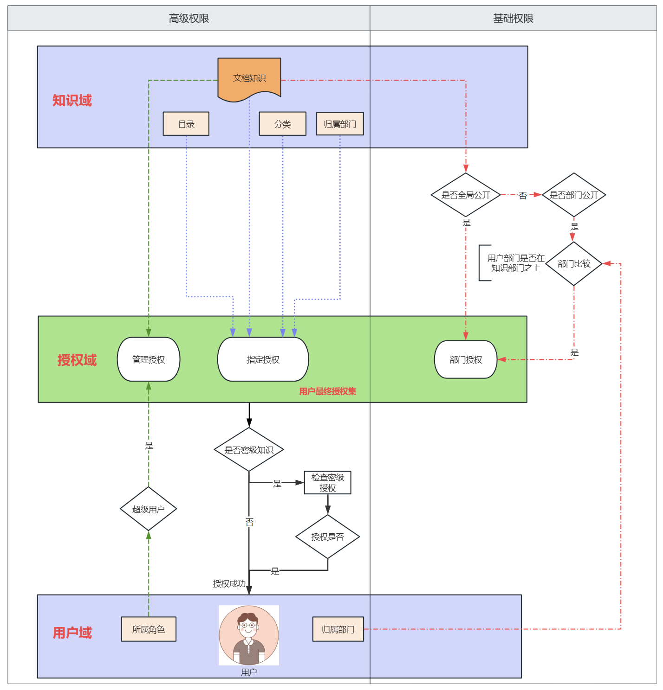

KMS知识图谱功能效果参考
-----------------------------------
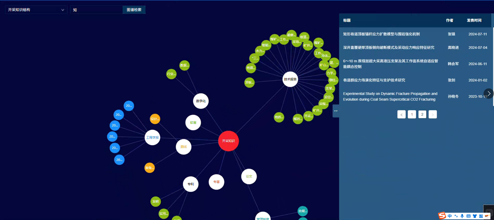

KMS功能思维导图
-----------------------------------
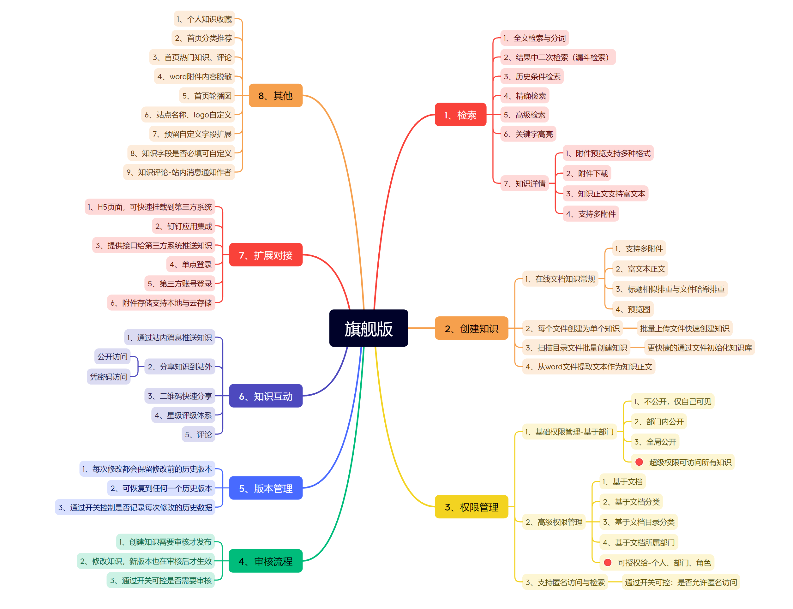

KMS技术架构图
-----------------------------------
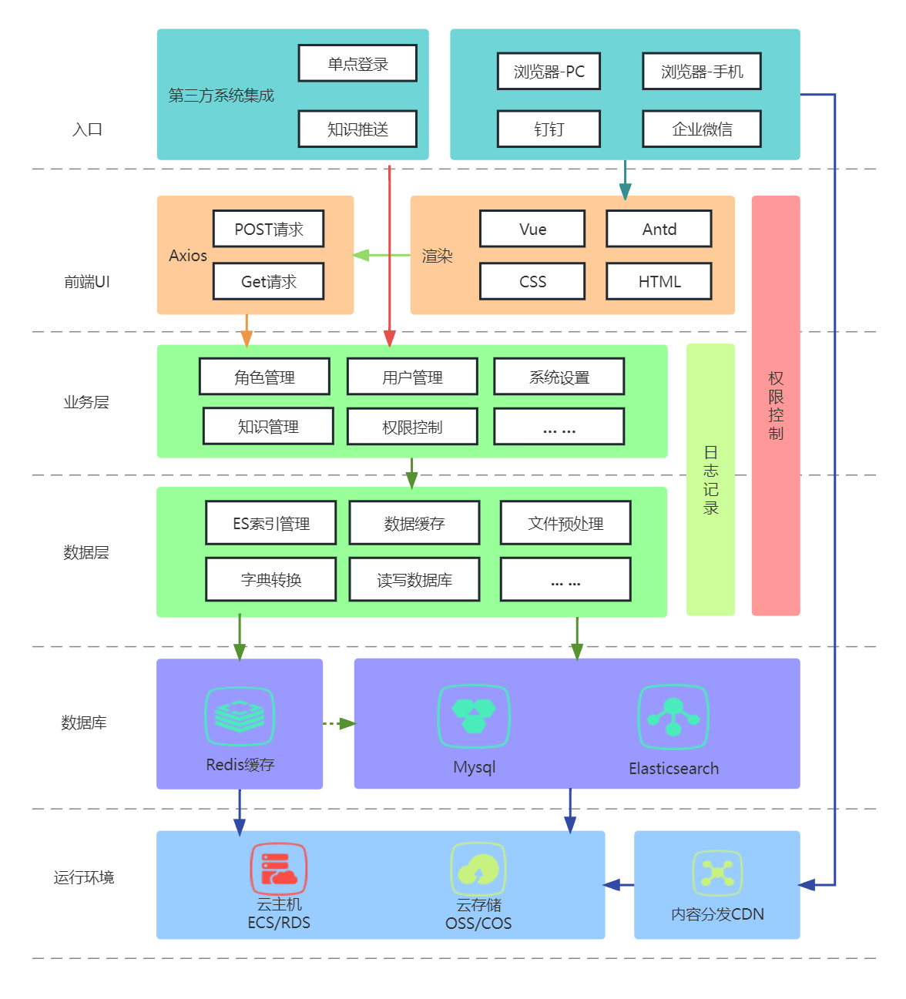


技术架构：
-----------------------------------
#### 技术亮点
- 主流技术，生态完善，易于维护
- 前后端分离，接口文档清晰，易于二次开发
- 后端采用ES搜索引擎，可以按需实行分部署部署
 
#### 开发环境
- 语言：Java 8
- IDE(JAVA)： IDEA / Eclipse安装lombok插件 
- IDE(前端)： WebStorm 或者 IDEA
- 依赖管理：Maven
- 数据库：MySQL5.7+  &  Oracle 11g & PostgreSQL 10.5
- 缓存：Redis
- Node Js: 10.0 +
- Npm: 5.6.0+
- Yarn: 1.21.1+ 

#### 后端
- 基础框架：Spring Boot 2.3.5.RELEASE
- 持久层框架：Mybatis-plus 3.4.1
- 检索引擎：ElasticSearch 7.6.1
- 文档处理与转换： Libre Office 7.1.4
- 文本提取：Tika 1.17
- 安全框架：Apache Shiro 1.7.0，Jwt 3.11.0  
- 数据库连接池：阿里巴巴Druid 1.1.22 
- 缓存框架：redis 
- 日志打印：logback 
- 其他：fastjson，poi，Swagger-ui，quartz, lombok（简化代码）等。


#### 前端
 
- [Vue 2.6.10](https://cn.vuejs.org/),[Vuex](https://vuex.vuejs.org/zh/),[Vue Router](https://router.vuejs.org/zh/)
- [Axios](https://github.com/axios/axios)
- [ant-design-vue](https://vuecomponent.github.io/ant-design-vue/docs/vue/introduce-cn/)
- [webpack](https://www.webpackjs.com/),[yarn](https://yarnpkg.com/zh-Hans/)
- [vue-cropper](https://github.com/xyxiao001/vue-cropper) - 头像裁剪组件
- [@antv/g2](https://antv.alipay.com/zh-cn/index.html) - Alipay AntV 数据可视化图表
- [Viser-vue](https://viserjs.github.io/docs.html#/viser/guide/installation)  - antv/g2 封装实现
- eslint，[@vue/cli 3.2.1](https://cli.vuejs.org/zh/guide)

### 功能模块
```
├─检索首页
│  ├─普通检索
│  ├─高级检索
│  ├─精准检索
│  ├─结果中二次检索
│  ├─文件预览
│  ├─知识版本控制
│  ├─知识详情页(包含知识分享、推送、评价、评论)
│  ├─目录分类浏览
├─个人中心
│  ├─我的知识
│  ├─我的收藏
│  ├─我的分享
│  ├─我的消息
│  ├─修改密码
├─知识管理
│  ├─待审核文件
│  ├─已审核文件 
│  ├─文件统计 
│  ├─工作流代办(复杂审核流程)
├─知识库配置
│  ├─系统参数
│  ├─密级定义
│  ├─自定义字段设置
│  ├─分类定义
│  ├─标签定义
│  ├─目录分类定义
│  ├─轮播图管理
│  ├─文件脱敏规则
├─知识权限管理
│  ├─附加权限设置
│  ├─密级放行设置
├─系统管理
│  ├─用户管理
│  ├─角色管理
│  ├─菜单管理
│  ├─权限设置（支持按钮权限、数据权限）
│  ├─表单权限（控制字段禁用、隐藏）
│  ├─部门管理 
├─日志
│  ├─知识操作记录
│  ├─系统日志 
├─工作流
│  ├─工作流设计
└─其他模块
   └─更多功能开发中。。
   
```

系统效果(智能版)
----

##### 公共检索
智能问答
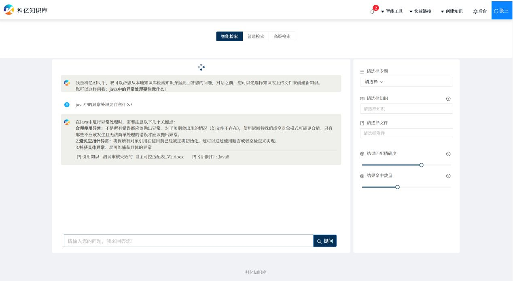
检索首页

检索结果

高级检索

知识专题
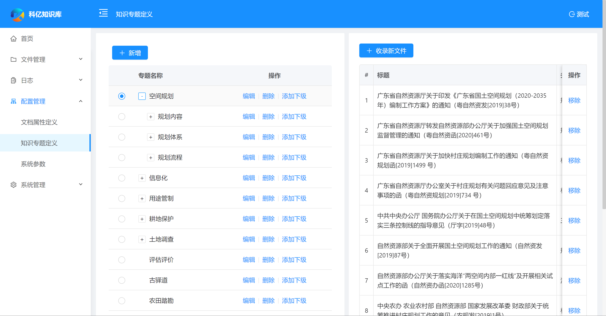
知识详情
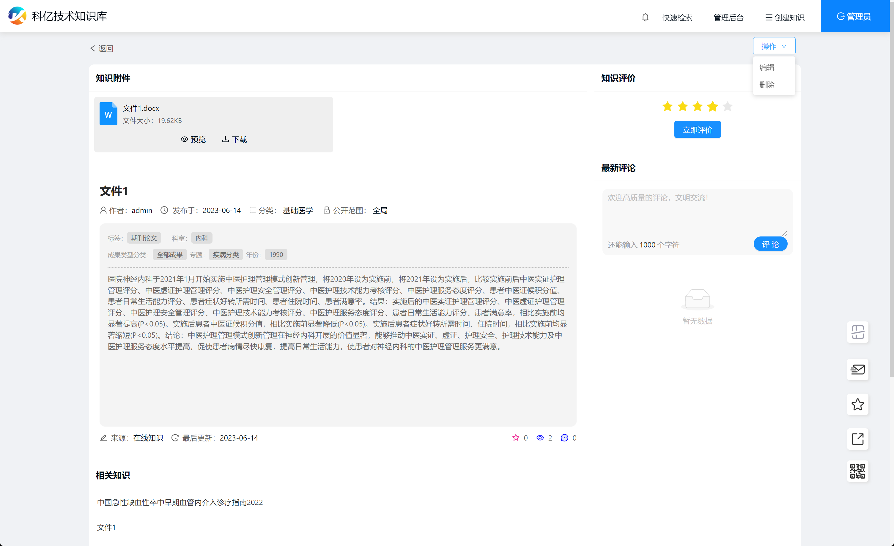
知识分享
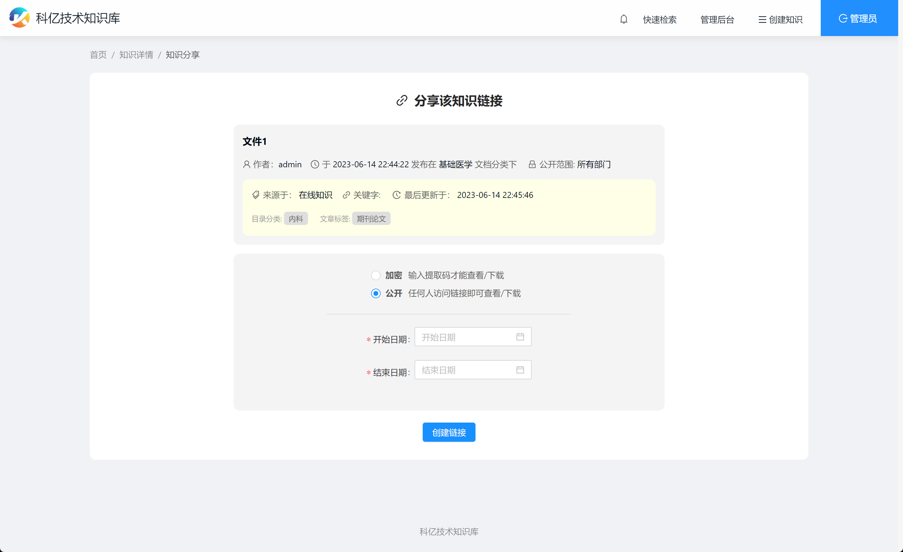


##### 管理后台
数据统计
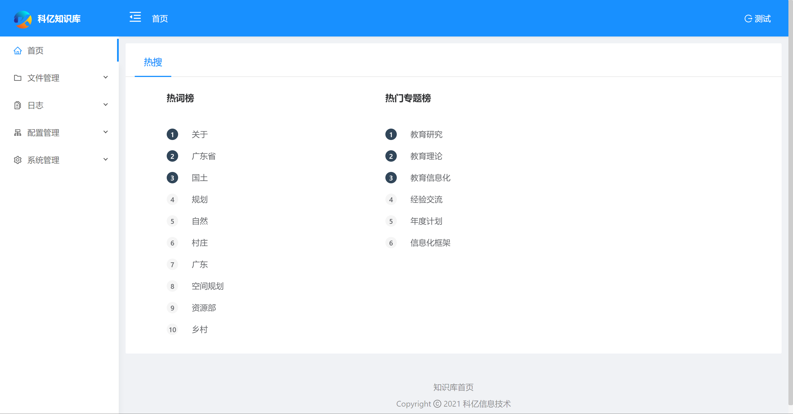
知识管理
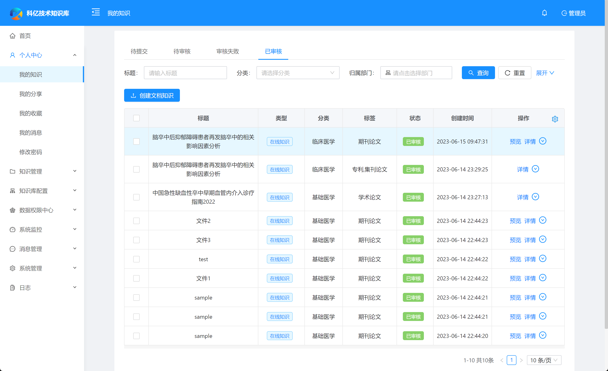
授权管理
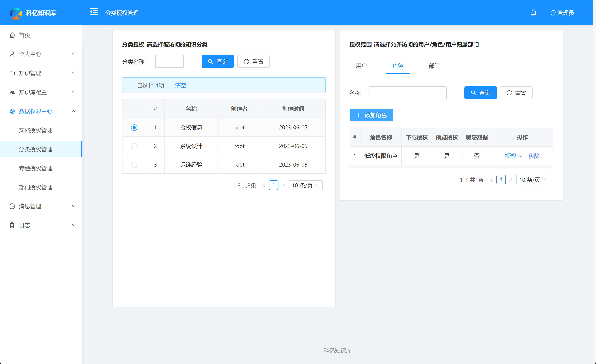
编辑与创建
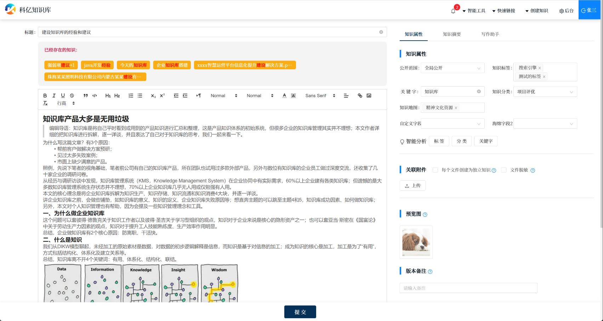


附属文档
----
- [Ant Design Vue](https://www.antdv.com/docs/vue/introduce-cn)


特别鸣谢
-----------------------------------
本项目采用Jeecg-boot开发框架，Jeecg-boot，一款优秀的后台管理快速开发框架，让你更专注于业务开发的实现。
- JeecgBoot： [http://doc.jeecg.com](http://doc.jeecg.com)


## 捐赠 

如果觉得还不错，请作者喝杯咖啡鼓励一下吧，敲代码不容易 ☺


