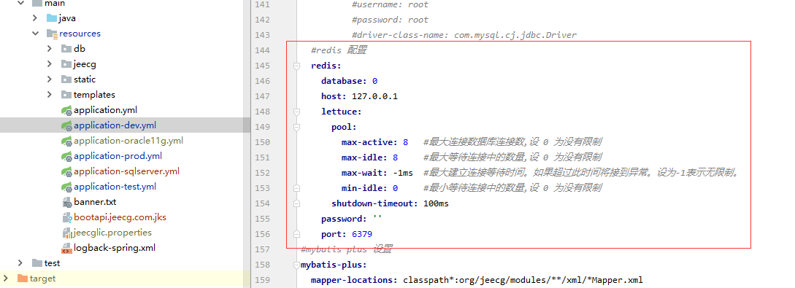
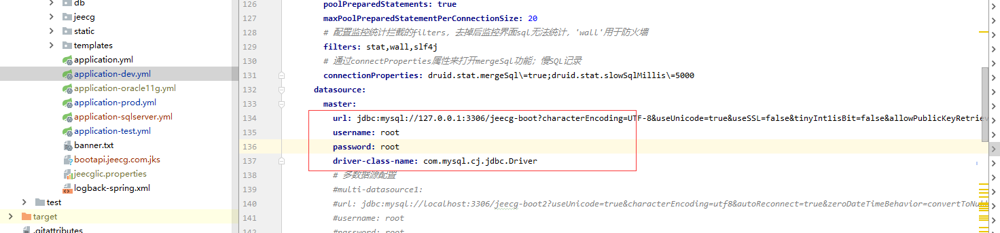
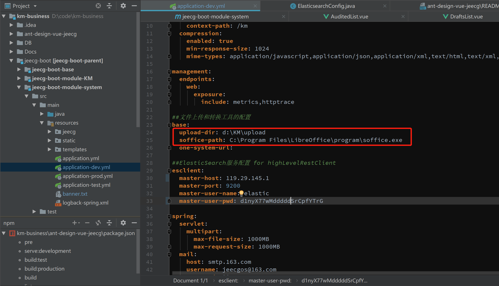
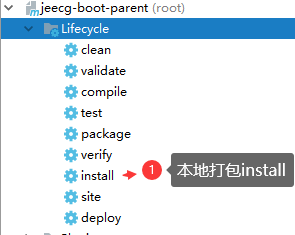
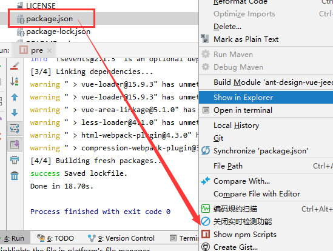
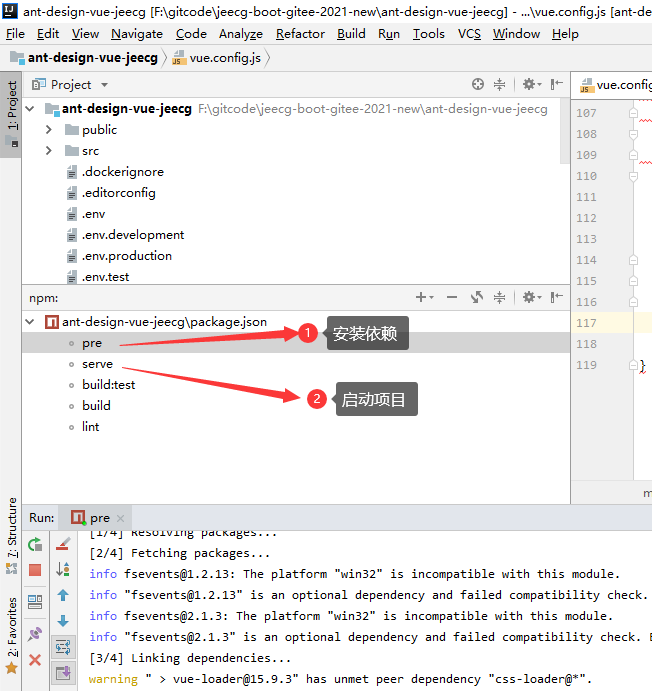
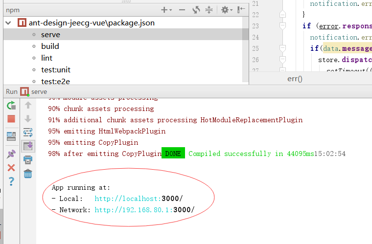

# 开发环境准备
> 1. 安装Java8，配置好环境变量
> 2. 安装Redis到本机，启动
> 3. 安装Mysql5.7，启动
> 4. 安装Elasticsearch，具体可参考：ES安装.md
> 5. 安装LibreOffice：
>     [linux下载链接](https://download.documentfoundation.org/libreoffice/stable/7.2.7/rpm/x86_64/LibreOffice_7.2.7_Linux_x86-64_rpm.tar.gz)
>     [win下载链接](http://download.documentfoundation.org/libreoffice/stable/7.2.7/win/x86_64/LibreOffice_7.2.7_Win_x64.msi)
# Docker快速运行
用IDE将代码编译环境与Maven环境搭建好，在Docker环境下，可以快速启动，具体参见 Docker方式快速运行.MD

# 项目启动与运行

## 后端启动
1. IDEA 打开项目：后端工程 jeecg-boot
2. 执行Sql脚本： db/km_mysql.sql 或 db/km_oracle.sql
脚本工作：自动创建库km, 并初始化数据 。
3. 修改项目配置 (数据库、redis、ES等)
配置文件： jeecg-boot-module-system/src/main/resources/application-dev.yml

redis配置：

DB配置：

ES配置：

LibreOffice与文件上传配置：

4. 通过右侧父POM进行install（下载依赖和打包）


5. 启动项目&访问：
> 以上配置完成后，即可启动后台项目。
> 找到类 jeecg-boot-module-system/src/main/java/org/jeecg/JeecgSystemApplication.java 右键执行启动。
> 通过 http://localhost:8080/km/doc.html 访问后台项目的swagger地址。

## 前端环境安装

```
安装node.js
如果您电脑未安装Node.js，请安装它。
验证
# 出现相应npm版本即可
npm -v
# 出现相应node版本即可
node -v
复制
安装yarn
# 全局安装yarn
npm i -g yarn
# 验证
yarn -v # 出现对应版本号即代表安装成功
配置镜像
npm config set registry https://registry.npm.taobao.org --global
npm config set disturl https://npm.taobao.org/dist --global

yarn config set registry https://registry.npm.taobao.org --global
yarn config set disturl https://npm.taobao.org/dist --global
```
## 前端启动
1. IDEA 打开项目：前端工程 ant-design-vue-jeecg

2. 选中package.json右键显示npm命令


3. 通过命令 yarn install或者快捷 pre下载依赖，点击serve 启动项目

4. 配置后台接口
找到文件.env.development，把Your_IP替换成你的后端服务ip

```
NODE_ENV=development
VUE_APP_API_BASE_URL=http://Your_IP:8080/km
```

5. 点击serve 启动项目，看到如下日志 则启动成功

6. 通过 http://localhost:3000 访问前端项目，默认账号密码： admin/123456